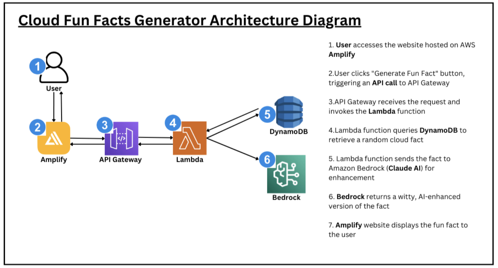

## Cloud Fun Facts Generator ☁️

A serverless mini app that fetches a random cloud fact from DynamoDB, asks Amazon Bedrock to rewrite it in a witty way, and returns it to a React UI hosted on AWS Amplify.

## Architecture Overview (high level):

## Services used:

1. **AWS Lambda**: Serverless compute for the backend API.
2. **Amazon API Gateway**: REST endpoint for the Lambda function.
3. **Amazon DynamoDB**: Fully managed, serverless NoSQL database for cloud facts.
4. **Amazon Bedrock**: Managed service to access foundation models to rewrite facts in a fun style.
5. **AWS Amplify Hosting**: CI/CD + hosting for the React frontend (static/SPA).
6. **AWS IAM**: Permissions for Lambda to read DynamoDB and invoke Bedrock.

## How it Works:

1. Deploy backend with AWS Lambda + API Gateway.
2. Store facts in Amazon DynamoDB.
3. Enhance output using Amazon Bedrock (GenAI).
4. Deploy Frontend with AWS Amplify (to display facts).

